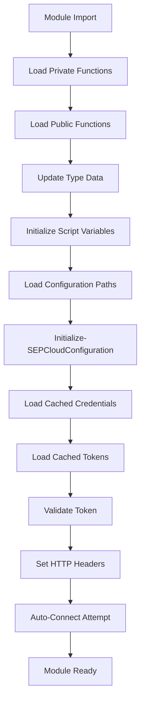
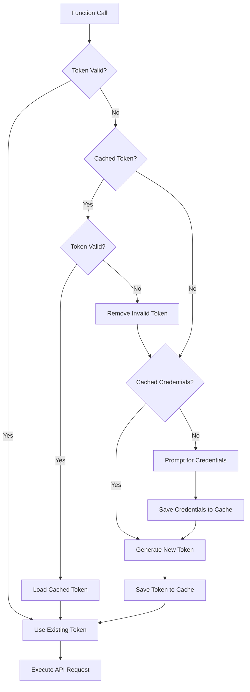
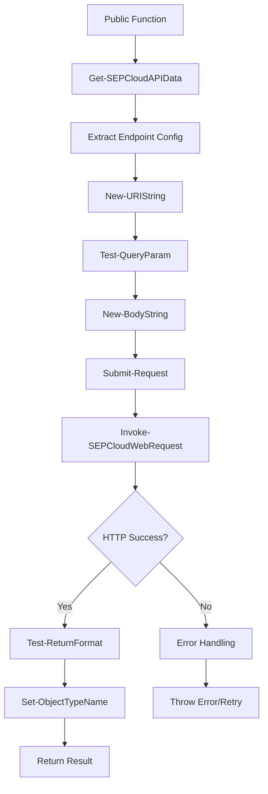

# PSSEPCloud Module System Architecture

This document provides an in-depth technical analysis of the PSSEPCloud module's internal architecture, system patterns, initialization process, and data flow. It serves as a comprehensive guide for developers, maintainers, and advanced users who need to understand how the module operates internally.

## Table of Contents

1. [Architecture Overview](#architecture-overview)
2. [Module Initialization Process](#module-initialization-process)
3. [Authentication & Security System](#authentication--security-system)
4. [API Request Pipeline](#api-request-pipeline)
5. [State Management](#state-management)
6. [Error Handling & Recovery](#error-handling--recovery)
7. [Data Flow Diagrams](#data-flow-diagrams)
8. [Core System Patterns](#core-system-patterns)
9. [Configuration Management](#configuration-management)
10. [Advanced Features](#advanced-features)

---

## Architecture Overview

The PSSEPCloud module implements a sophisticated **layered architecture** similar to enterprise SDK patterns, with clear separation of concerns and well-defined interfaces between components.

### System Components

```
┌─────────────────────────────────────────────────────────────┐
│                    PUBLIC INTERFACE                         │
├─────────────────────────────────────────────────────────────┤
│               COMMAND PROCESSORS                            │
├─────────────────────────────────────────────────────────────┤
│                API DATA REPOSITORY                          │
├─────────────────────────────────────────────────────────────┤
│           REQUEST CONSTRUCTION LAYER                        │
├─────────────────────────────────────────────────────────────┤
│              AUTHENTICATION LAYER                           │
├─────────────────────────────────────────────────────────────┤
│               HTTP EXECUTION LAYER                          │
├─────────────────────────────────────────────────────────────┤
│             RESPONSE PROCESSING LAYER                       │
├─────────────────────────────────────────────────────────────┤
│             CONFIGURATION & STATE LAYER                     │
└─────────────────────────────────────────────────────────────┘
```

### Core Architectural Principles

1. **Single Responsibility**: Each component has a clearly defined purpose
2. **Dependency Injection**: Functions receive dependencies through parameters
3. **State Isolation**: Global state is managed through script-scoped variables
4. **Error Boundaries**: Each layer handles its own error conditions
5. **Extensibility**: New endpoints can be added without code changes

---

## Module Initialization Process

### Startup Sequence

The module initialization follows a carefully orchestrated sequence to ensure all components are properly loaded and configured:



### Initialization Components

#### 1. **Script Variable Initialization**

Located in `zz_Initialize-SEPCloudConfiguration.ps1`:

```powershell
# Global connection object
[PSCustomObject] $script:SEPCloudConnection = [PSCustomObject]@{
    BaseURL     = "api.sep.eu.securitycloud.symantec.com"  # Default: Europe
    Credential  = $null                                      # OAuth credentials
    AccessToken = $null                                      # Bearer token
    time        = (Get-Date)                                # Session timestamp
    header      = $null                                     # HTTP headers
}

# Configuration paths
[PSCustomObject] $script:configuration = [PSCustomObject]@{
    BaseURL           = "api.sep.eu.securitycloud.symantec.com"
    SEPCloudCredsPath = "%LocalAppData%\PSSEPCloud\creds.xml"
    CachedTokenPath   = "%LocalAppData%\PSSEPCloud\accessToken.xml"
}
```

#### 2. **Type System Registration**

```powershell
# Register custom PowerShell types
Update-TypeData -PrependPath (Join-Path -Path $PSScriptRoot -ChildPath 'PSSEPCloud.Types.ps1xml')
```

#### 3. **Credential and Token Recovery**

The initialization process attempts to restore previous session state:

```powershell
# Credential recovery
if (Test-Path -Path $script:configuration.SEPCloudCredsPath) {
    $script:Credential = Import-Clixml -Path $script:configuration.SEPCloudCredsPath
    $script:SEPCloudConnection.Credential = $script:Credential
}

# Token recovery
if (Test-Path -Path $script:configuration.CachedTokenPath) {
    $script:SEPCloudConnection.AccessToken = Import-Clixml -Path $script:configuration.CachedTokenPath
}
```

#### 4. **Silent Connection Attempt**

```powershell
# Attempt automatic connection using cached credentials
if (Get-Command -Name 'Connect-SEPCloud' -ErrorAction SilentlyContinue) {
    Connect-SEPCloud -cacheOnly
}
```

---

## Authentication & Security System

### Authentication Flow Hierarchy

The module implements a sophisticated **authentication cascade** that attempts multiple methods in order of preference:

```
1. In-Memory Token (Session Cache)
    ↓ [If Expired/Missing]
2. Cached Disk Token (Encrypted XML)
    ↓ [If Expired/Missing]
3. In-Memory Credentials (Session Cache)
    ↓ [If Missing]
4. Cached Disk Credentials (Encrypted XML)
    ↓ [If Missing]
5. Interactive Credential Prompt
```

### Token Lifecycle Management

#### **Token Validation Process**

File: `Test-SEPCloudToken.ps1`

```powershell
function Test-SEPCloudToken {
    # Check parameter token
    if ($token -and (Get-Date) -lt $token.Expiration) {
        return $True
    }
    
    # Check in-memory token
    if ($script:SEPCloudConnection.AccessToken) {
        if ((Get-Date) -lt $script:SEPCloudConnection.AccessToken.Expiration) {
            return $True
        } else {
            Remove-SEPCloudToken  # Auto-cleanup expired tokens
            return $false
        }
    }
    
    return $False
}
```

#### **Token Generation Process**

File: `Get-SEPCloudToken.ps1`

```powershell
# OAuth2 Base64 encoding
$encodedCreds = [convert]::ToBase64String([Text.Encoding]::ASCII.GetBytes(($clientId + ':' + $secret)))

# API request headers
$headers = @{
    Authorization = "Basic " + $encodedCreds
    Accept = "application/json"
}

# Token request to /v1/oauth2/tokens
$response = Submit-Request -uri $fullUri -header $headers -method "POST"
```

### Security Features

#### **Encrypted Storage**

- **Technology**: PowerShell's `Export-CliXml` / `Import-CliXml`
- **Encryption**: Windows DPAPI (user-specific encryption)
- **NOTE** encryption occur only on Windows systems. **Linux contains the plan text ID & secret**
- **Storage Locations**:
  - Credentials: `%LocalAppData%\PSSEPCloud\creds.xml`
  - Tokens: `%LocalAppData%\PSSEPCloud\accessToken.xml`

#### **Regional Security Isolation**

Different regions use isolated base URLs for security compartmentalization:

```powershell
# Regional endpoints
$RegionURLs = @{
    "North America" = "api.sep.us.securitycloud.symantec.com"
    "Europe"        = "api.sep.eu.securitycloud.symantec.com"
    "India"         = "api.sep.in.securitycloud.symantec.com"
}
```

---

## API Request Pipeline

### Complete Request Flow

The module processes API requests through a **standardized pipeline** that ensures consistency and reliability:

```
Public Function
      ↓
Get-SEPCloudAPIData (Endpoint Definition)
      ↓
New-URIString (URL Construction)
      ↓
Test-QueryParam (Query String Building)
      ↓
New-BodyString (Request Body Creation)
      ↓
Submit-Request (Request Orchestration)
      ↓
Invoke-SEPCloudWebRequest (HTTP Execution)
      ↓
Test-ReturnFormat (Response Processing)
      ↓
Set-ObjectTypeName (Type Assignment)
      ↓
Return to User
```

### Pipeline Components

#### 1. **API Data Repository**

File: `Get-SEPCloudAPIData.ps1`

The central repository contains **comprehensive endpoint definitions**:

```powershell
$api = @{
    'Get-SEPCloudDevice' = @{
        '1.0' = @{
            Description = 'retrieve the list of devices'
            URI         = '/v1/devices'
            Method      = 'Get'
            Query       = @{
                offset               = 'offset'
                device_status        = 'device_status'
                name                 = 'name'
                # ... more parameters
            }
            Result      = 'devices'
            ObjectTName = 'SEPCloud.Device'
        }
    }
}
```

#### 2. **URI Construction**

File: `New-URIString.ps1`

```powershell
# Combines base URL with endpoint pattern
$fullURI = "https://" + $BaseURL + $URI

# Handles dynamic ID substitution
if ($URI -match '\{id\}') {
    $fullURI = $fullURI -replace '\{id\}', $ID
}
```

#### 3. **Query Parameter Processing**

File: `Test-QueryParam.ps1`

```powershell
# Builds query strings from function parameters
$QueryStrings = @{}
foreach ($queryKey in $Query.Keys) {
    if ($BoundParameters.ContainsKey($queryKey)) {
        $QueryStrings.Add($queryKey, $BoundParameters[$queryKey])
    }
}
```

#### 4. **Body Construction**

File: `New-BodyString.ps1`

```powershell
# Creates JSON request bodies
$BodyHash = @{}
foreach ($bodyKey in $Body.Keys) {
    if ($BoundParameters.ContainsKey($bodyKey)) {
        $BodyHash.Add($bodyKey, $BoundParameters[$bodyKey])
    }
}
return $BodyHash | ConvertTo-Json -Depth 100
```

#### 5. **HTTP Execution**

File: `Invoke-SEPCloudWebRequest.ps1`

Advanced HTTP handling with **redirect support**:

```powershell
# Custom WebRequest implementation
$initialRequest = [System.Net.WebRequest]::CreateHttp($uri)
$initialRequest.Method = $method
$initialRequest.AllowAutoRedirect = $false

# Handle redirects while preserving Authorization headers
if ($response.StatusCode.value__ -in (301, 302, 303, 307, 308)) {
    $redirectUrl = $response.GetResponseHeader("Location")
    # Create new request with preserved headers
}
```

---

## State Management

### Global State Variables

The module maintains state through **script-scoped variables** that persist throughout the PowerShell session:

```powershell
# Primary connection object
$script:SEPCloudConnection = [PSCustomObject]@{
    BaseURL     = "api.sep.eu.securitycloud.symantec.com"
    Credential  = $null    # Base64 encoded OAuth credentials
    AccessToken = $null    # Bearer token object with expiration
    time        = (Get-Date)
    header      = $null    # HTTP headers for requests
}

# Configuration settings
$script:configuration = [PSCustomObject]@{
    BaseURL           = "api.sep.eu.securitycloud.symantec.com"
    SEPCloudCredsPath = "%LocalAppData%\PSSEPCloud\creds.xml"
    CachedTokenPath   = "%LocalAppData%\PSSEPCloud\accessToken.xml"
}

# Module metadata
[string] $script:ModuleName = "PSSEPCloud"
```

### State Synchronization

#### **Memory ↔ Disk Synchronization**

```powershell
# Save credentials to disk
Export-Clixml -InputObject $Credential -Path $script:configuration.SEPCloudCredsPath

# Save token to disk
Export-Clixml -InputObject $AccessToken -Path $script:configuration.CachedTokenPath

# Load from disk
$script:Credential = Import-Clixml -Path $script:configuration.SEPCloudCredsPath
```

#### **Header Management**

```powershell
# Update headers when token changes
$script:SEPCloudConnection.Header = @{
    'Authorization' = $script:SEPCloudConnection.AccessToken.Token_Bearer
    'User-Agent'    = New-UserAgentString
}
```

---

## Error Handling & Recovery

### Multi-Layer Error Handling

The module implements **comprehensive error handling** at multiple levels:

#### 1. **Parameter Validation Layer**

```powershell
# Built-in PowerShell parameter validation
[Parameter(Mandatory = $true)]
[ValidateNotNullOrEmpty()]
[string] $DeviceId
```

#### 2. **Pre-Request Validation Layer**

```powershell
# Connection validation
if (-not (Test-SEPCloudConnection)) {
    throw "Not connected to SEP Cloud. Run Connect-SEPCloud first."
}

# Token validation
if (-not (Test-SEPCloudToken)) {
    Write-Warning "Token expired. Attempting to refresh..."
    Connect-SEPCloud -cacheOnly
}
```

#### 3. **HTTP Error Handling Layer**

```powershell
# In Invoke-SEPCloudWebRequest.ps1
try {
    $response = $request.GetResponse()
} catch [System.Net.WebException] {
    $statusCode = $_.Exception.Response.StatusCode
    $errorBody = $_.Exception.Response.GetResponseStream()
    Write-Error "HTTP $statusCode: $errorBody"
}
```

#### 4. **Response Validation Layer**

```powershell
# In Test-ReturnFormat.ps1
if (-not $Response) {
    Write-Warning "Empty response received"
    return $null
}

if ($Response.error) {
    throw "API Error: $($Response.error.message)"
}
```

### Automatic Recovery Mechanisms

#### **Token Refresh**

```powershell
# Automatic token refresh on expiration
if (-not (Test-SEPCloudToken)) {
    if ($script:SEPCloudConnection.Credential) {
        Get-SEPCloudToken -UseStoredCredentials
    }
}
```

#### **Cache Cleanup**

```powershell
# Remove corrupted cache files
try {
    $token = Import-Clixml -Path $CachedTokenPath
} catch {
    Remove-Item -Path $CachedTokenPath -Force -ErrorAction SilentlyContinue
}
```

---

## Data Flow Diagrams

### Authentication Flow



### API Request Flow



---

## Core System Patterns

### 1. **Repository Pattern**

The `Get-SEPCloudAPIData` function implements the **Repository Pattern**:

```powershell
# Single source of truth for all API endpoints
$api = @{
    'EndpointName' = @{
        'Version' = @{
            Description = 'Human readable description'
            URI         = '/v1/endpoint/{id}'
            Method      = 'HTTP_METHOD'
            Body        = @{ param1 = 'param1'; param2 = 'param2' }
            Query       = @{ filter = 'filter'; limit = 'limit' }
            Result      = 'response_wrapper_key'
            ObjectTName = 'PowerShell.Type.Name'
        }
    }
}
```

### 2. **Builder Pattern**

Request construction uses the **Builder Pattern**:

```powershell
# Step-by-step request building
$request = New-Object RequestBuilder
$request.WithURI($endpoint.URI)
        .WithMethod($endpoint.Method)
        .WithQuery($queryParams)
        .WithBody($bodyParams)
        .Build()
```

### 3. **Factory Pattern**

HTTP client creation uses the **Factory Pattern**:

```powershell
# Create appropriate HTTP client based on requirements
function New-WebRequest {
    param($Uri, $Method, $Headers, $Body)
    
    $request = [System.Net.WebRequest]::CreateHttp($Uri)
    $request.Method = $Method
    # Configure based on parameters
    return $request
}
```

### 4. **Observer Pattern**

Token expiration monitoring:

```powershell
# Automatic token monitoring and refresh
if ((Get-Date) -gt $script:SEPCloudConnection.AccessToken.Expiration) {
    Write-Verbose "Token expired, refreshing..."
    Remove-SEPCloudToken
    Connect-SEPCloud -cacheOnly
}
```

---

## Configuration Management

### Configuration Hierarchy

```
1. Function Parameters (Highest Priority)
2. Environment Variables
3. User Configuration Files
4. Module Defaults (Lowest Priority)
```

### Configuration Sources

#### **1. Module Defaults**

```powershell
# Built-in defaults
$DefaultConfig = @{
    BaseURL = "api.sep.eu.securitycloud.symantec.com"
    Region  = "Europe"
    Timeout = 30
}
```

#### **2. User Configuration**

```powershell
# User-specific settings
$UserConfigPath = Join-Path $env:APPDATA "PSSEPCloud\config.json"
```

#### **3. Environment Variables**

```powershell
# Environment variable override
$BaseURL = $env:SEPCLOUD_BASE_URL ?? $DefaultConfig.BaseURL
```

### Regional Configuration

```powershell
# Region-specific settings
$RegionConfig = @{
    "North America" = @{
        BaseURL = "api.sep.us.securitycloud.symantec.com"
        Timezone = "EST"
    }
    "Europe" = @{
        BaseURL = "api.sep.eu.securitycloud.symantec.com"
        Timezone = "CET"
    }
    "India" = @{
        BaseURL = "api.sep.in.securitycloud.symantec.com"
        Timezone = "IST"
    }
}
```

---

## Advanced Features

### 1. **Automatic Pagination**

```powershell
# In Get-SEPCloudDevice and similar functions
do {
    $result = Submit-Request -uri $uri -method $method
    $allResults += $result.devices
    
    if ($result.total -gt $allResults.Count) {
        $uri = Update-URIWithOffset -Uri $uri -Offset $allResults.Count
    }
} while ($allResults.Count -lt $result.total)
```

### 2. **Smart Caching**

```powershell
# Cache frequently accessed data
$script:CachedGroups = @{}

function Get-SEPCloudGroup {
    if (-not $script:CachedGroups.ContainsKey($GroupId)) {
        $script:CachedGroups[$GroupId] = Submit-Request -uri $uri
    }
    return $script:CachedGroups[$GroupId]
}
```

### 3. **Retry Logic**

```powershell
# Automatic retry with exponential backoff
$attempt = 0
$maxAttempts = 3

do {
    try {
        $result = Submit-Request -uri $uri
        break
    } catch {
        $attempt++
        if ($attempt -ge $maxAttempts) { throw }
        Start-Sleep -Seconds ([Math]::Pow(2, $attempt))
    }
} while ($attempt -lt $maxAttempts)
```

### 4. **User-Agent Generation**

File: `New-UserAgentString.ps1`

```powershell
# Comprehensive user agent string
$UserAgent = "$ModuleName-$ModuleVersion--$PSVersion--platform--$OS--platform_version--$OSVersion"
# Example: "PSSEPCloud-1.0.0--7.4.2--platform--Win32NT--platform_version--Microsoft.Windows.10.0.22631"
```

### 5. **ShouldProcess Integration**

```powershell
# Consistent -WhatIf/-Confirm support
if ($PSCmdlet.ShouldProcess($DeviceId, "Block File")) {
    Submit-Request -uri $uri -method "POST" -body $body
}
```

---

## Performance Considerations

### 1. **Lazy Loading**

```powershell
# Load API data only when needed
if (-not $script:APIDataCache) {
    $script:APIDataCache = Get-SEPCloudAPIData
}
```

### 2. **Connection Pooling**

```powershell
# Reuse HTTP connections
$request.KeepAlive = $true
$request.ServicePoint.Expect100Continue = $false
```

### 3. **Parallel Processing**

```powershell
# Process multiple devices in parallel
$DeviceIds | ForEach-Object -Parallel {
    Start-SEPCloudScan -DeviceId $_
} -ThrottleLimit 5
```

---

## Security Considerations

### 1. **Credential Protection**

- **No Plain Text Storage**: All credentials encrypted using DPAPI
- **Session Isolation**: Credentials are user-specific
- **Automatic Cleanup**: Invalid tokens are automatically removed

### 2. **Network Security**

- **HTTPS Only**: All communications over TLS
- **Certificate Validation**: SSL certificates are validated
- **Redirect Handling**: Authorization headers preserved during redirects

### 3. **Input Validation**

- **Parameter Validation**: All inputs validated before processing
- **SQL Injection Protection**: Parameterized queries (where applicable)
- **XSS Prevention**: Output encoding for sensitive data

---

This comprehensive system architecture documentation provides the foundation for understanding, maintaining, and extending the PSSEPCloud module. The modular design and clear separation of concerns make it easy to troubleshoot issues, add new features, and ensure reliable operation across different environments.
